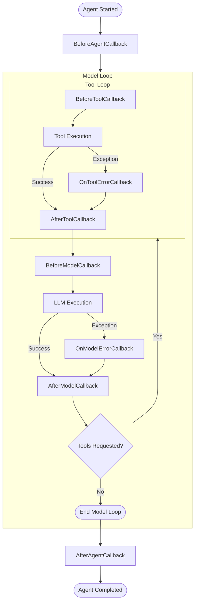

# Agent Lifecycle & Callbacks

The Agent Development Kit (ADK) provides a rich set of lifecycle callbacks that allow you to execute custom logic at various stages of an agent's execution. These callbacks are essential for tasks like state management, auditing, dynamic system instructions, and emitting custom events (like A2UI components).

> **Note:** Unlike older architectures that required complex lists of delegates, the C# ADK uses a simple **single-cast delegate** model for configuration, ensuring predictability and consistency—especially in asynchronous workflows.

## The Execution Pipeline

When a `Runner` invokes an agent, the execution follows a well-defined pipeline. If the agent is an `LlmAgent` (which represents the vast majority of agents), the pipeline extends to cover interactions with the underlying language model and any tools.



1. **Agent Started**: The agent is initialized and the session context is loaded.
2. **`BeforeAgentCallback`**: Executed before the agent begins its core logic.
3. **Model Loop** (for `LlmAgent`):
   - **`BeforeModelCallback`**: Executed just before the LLM is called. You can inspect or modify the `LlmRequest` here.
   - **LLM Execution**: The LLM processes the request.
     - *If the LLM fails:* **`OnModelErrorCallback`** is triggered.
   - **`AfterModelCallback`**: Executed immediately after the LLM responds.
   - **Tool Loop** (if the LLM requests tool execution):
     - **`BeforeToolCallback`**: Executed before a specific tool is run.
     - **Tool Execution**: The tool's `RunAsync` method is called.
       - *If the tool fails:* **`OnToolErrorCallback`** is triggered.
     - **`AfterToolCallback`**: Executed after the tool successfully completes.
4. **Agent Completed**: The agent finishes processing.
5. **`AfterAgentCallback`**: Executed before control is returned to the runner.

## Configuring Callbacks

Callbacks are configured directly on the agent's configuration object (e.g., `BaseAgentConfig` or `LlmAgentConfig`). Each property accepts a single asynchronous delegate.

### Agent-Level Callbacks

Available on all agents deriving from `BaseAgent`:

| Callback | Signature | Description |
| :--- | :--- | :--- |
| **`BeforeAgentCallback`** | `Func<AgentContext, Task<Content?>>` | Fires before the agent starts processing. Return a `Content` object to short-circuit and return immediately, or `null` to continue. |
| **`AfterAgentCallback`** | `Func<AgentContext, Task<Content?>>` | Fires after the agent has completed processing. Use to emit a final event (e.g., UI component). Return `null` to skip emitting an extra event. |

### Model & Tool Callbacks

Available exclusively on `LlmAgent`:

| Callback | Signature | Description |
| :--- | :--- | :--- |
| **`BeforeModelCallback`** | `Func<AgentContext, LlmRequest, Task<LlmResponse?>>` | Modify the request (e.g., system instructions). Return an `LlmResponse` to bypass the LLM call entirely. |
| **`AfterModelCallback`** | `Func<AgentContext, LlmResponse, Task<LlmResponse?>>` | Inspect or modify the response before processing (e.g., logging token usage). |
| **`OnModelErrorCallback`** | `Func<AgentContext, LlmRequest, Exception, Task<LlmResponse?>>` | Fires if the LLM provider throws an exception. Return a fallback `LlmResponse` to recover gracefully. |
| **`BeforeToolCallback`** | `Func<IBaseTool, Dictionary<string, object?>, AgentContext, Task<Dictionary<string, object?>?>>` | Fires before a tool executes. Return a dictionary to bypass execution and mock the result. |
| **`AfterToolCallback`** | `Func<IBaseTool, Dictionary<string, object?>, AgentContext, Dictionary<string, object?>, Task<Dictionary<string, object?>?>>` | Fires after a tool executes. Modify and return a new dictionary to change the output. |
| **`OnToolErrorCallback`** | `Func<IBaseTool, Dictionary<string, object?>, AgentContext, Exception, Task<Dictionary<string, object?>?>>` | Fires if a tool throws an exception. Return a valid result dictionary to suppress the error. |

## Example: Using Callbacks

Here is an example demonstrating several lifecycle callbacks, including recovering from an LLM provider error:

```csharp
var agent = new LlmAgent(new LlmAgentConfig
{
    Name = "callback_demo_agent",
    Model = "gemini-2.5-flash",
    Instruction = "You are a helpful assistant.",
    
    // Inject a dynamic instruction before the model runs
    BeforeModelCallback = (ctx, request) => 
    {
        request.Config ??= new GenerateContentConfig();
        request.Config.SystemInstruction += "\nAlways be extremely polite.";
        return Task.FromResult<LlmResponse?>(null);
    },

    // Catch and recover from LLM provider errors (e.g. rate limits)
    OnModelErrorCallback = (ctx, request, ex) =>
    {
        Console.WriteLine($"LLM Error: {ex.Message}");
        // Return a fallback response to keep the conversation flowing
        var fallback = new LlmResponse { Text = "I'm currently experiencing high traffic. Please try again later." };
        return Task.FromResult<LlmResponse?>(fallback);
    },

    // Catch and recover from tool errors
    OnToolErrorCallback = (tool, args, ctx, ex) =>
    {
        Console.WriteLine($"Tool {tool.Name} failed: {ex.Message}");
        // Return a mock result to prevent the agent from crashing
        var recoveryResult = new Dictionary<string, object?> { ["error"] = "Service temporarily unavailable" };
        return Task.FromResult<Dictionary<string, object?>?>(recoveryResult);
    },

    // Emit a custom UI component when the agent finishes
    AfterAgentCallback = async (ctx) =>
    {
        var rootNode = new A2uiText("This conversation has ended.");
        var part = A2uiBuilder.BeginRendering(rootNode);
        
        return new Content 
        { 
            Role = "model", 
            Parts = new List<Part> { part } 
        };
    }
});
```

## Callbacks vs. Plugins

Callbacks are excellent for configuring specific behavior on a **single agent instance**. However, if you need logic that applies to *all* agents in your application (like global telemetry, auditing, or security constraints), you should use the **[Plugin System](plugins.md)** instead. Plugins tap into these exact same lifecycle events but operate globally at the `Runner` level.
