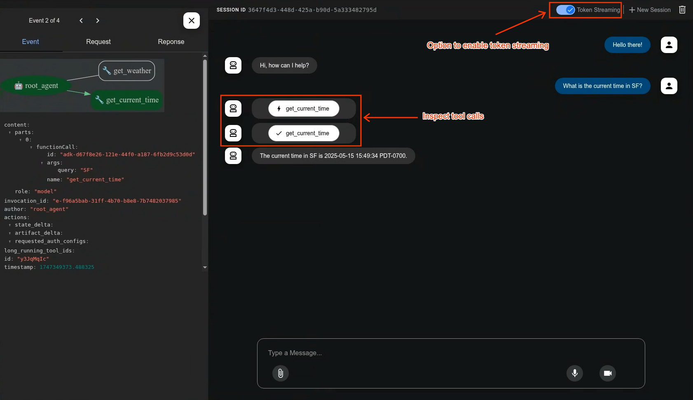

<html>
    <h2 align="center">
      
    </h2>
    <h3 align="center">
      An open-source, code-first .NET framework for building, evaluating, and deploying sophisticated AI agents with flexibility and control.
    </h3>
</html>

# ADK for .NET

Welcome to the Agent Development Kit (ADK) for .NET (C#). The ADK is a modern, extensible, and high-performance framework for building agentic applications. 

Whether you are building simple chat interfaces, complex multi-agent orchestrations, or autonomous systems with access to third-party tools via the Model Context Protocol (MCP), the ADK provides the primitives required to construct robust AI-driven logic.

## Quick Start

- **Prerequisites**: .NET SDK 10.0+
- **Build the solution**:

```bash
dotnet restore "GoogleAdk/GoogleAdk.slnx"
dotnet build "GoogleAdk/GoogleAdk.slnx"
```

## Minimal Agent Example

Here is a complete, runnable example of an agent that responds to a single user message.

```csharp
using System;
using GoogleAdk.Core;
using GoogleAdk.Core.Agents;
using GoogleAdk.Core.Abstractions.Models;
using GoogleAdk.Core.Runner;
using GoogleAdk.Models.Gemini;

// 1. Load environment variables (e.g. GOOGLE_CLOUD_PROJECT, GOOGLE_CLOUD_LOCATION)
AdkEnv.Load();

// 2. Configure the agent
var agent = new LlmAgent(new LlmAgentConfig
{
    Name = "hello_agent",
    Model = "gemini-2.5-flash",
    Instruction = "You are a helpful assistant. Answer briefly."
});

// 3. Set up the runner to execute the agent.
// InMemoryRunner is excellent for local testing and CLI apps.
var runner = new InMemoryRunner("hello-app", agent);

// 4. Create the user input
var content = new Content
{
    Role = "user",
    Parts = [new Part { Text = "Hello, ADK!" }]
};

// 5. Run the agent and stream the response
await foreach (var evt in runner.RunAsync("user-1", "session-1", content))
{
    // The agent streams events back; we print the text parts as they arrive.
    if (evt.Content?.Parts?.FirstOrDefault()?.Text is string text)
    {
        Console.WriteLine(text);
    }
}
```

## Web UI

A built-in development UI to help you test, evaluate, debug, and showcase your agent(s).



## Core Concepts (API Overview)

The ADK revolves around several core domain models:

- **Agents**: The execution logic. 
  - `LlmAgent`: Powered directly by an LLM model.
  - `SequentialAgent`, `ParallelAgent`, `LoopAgent`: Structural agents for orchestrating multiple sub-agents.
- **Tools**: Actions an agent can take. 
  - `IBaseTool`, `BaseToolset`. Tools are automatically generated from your C# code via source generators (`[FunctionTool]`).
- **Runner**: The execution engine. 
  - `Runner`, `InMemoryRunner`. It manages the state, context, session history, and event streams.
- **Sessions & Events**: The communication protocol. 
  - Interactions are recorded as `Event`s within a persistent `Session`.
- **Artifacts**: Data outputs.
  - Services like `FileArtifactService` or `InMemoryArtifactService` store generated reports, files, or images.
- **Plugins**: Middleware.
  - Intercept the agent lifecycle via `BasePlugin` to add logging, security, or metrics.

## Documentation Sections

Below is the comprehensive guide to utilizing all features of the ADK:

- [Getting Started](getting-started.md)
- [Running Agents](running-agents.md)
- [Agents & Features](features.md)
- [Tools & Toolsets](tools.md)
- [Orchestration (Multi-Agent)](orchestration.md)
- [Streaming & Live/Bidi](streaming.md)
- [Model Context Protocol (MCP)](mcp.md)
- [Agent-to-Agent (A2A)](a2a.md)
- [Code Execution](code-execution.md)
- [Planning](planning.md)
- [Human-in-the-Loop (Confirmation)](human-in-the-loop.md)
- [Output Schema (JSON)](output-schema.md)
- [Prompt Caching](caching.md)
- [Artifacts](artifacts.md)
- [Plugins](plugins.md)
- [Evaluation & Optimization](evaluation-optimization.md)
- [Feature Flags](feature-flags.md)
- [Models](models.md)
- [Testing](testing.md)
- [Text-to-Speech (TTS)](tts.md)