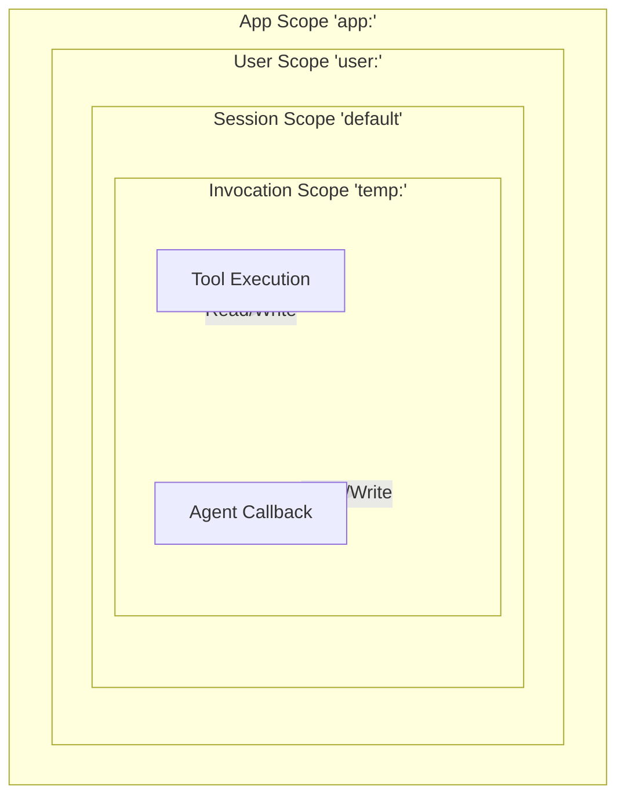

# State Management

The ADK provides a built-in `State` system to manage conversational context, session data, and application-level state throughout an agent's execution. State allows you to persist data across multiple turns of a conversation or temporarily within a single invocation.

## State Scopes

State is managed using keys, and the framework recognizes several prefixes to determine the scope and lifecycle of the data:

| Prefix | Scope | Lifecycle & Persistence |
| :--- | :--- | :--- |
| **`user:`** | User | Persists across all of the user's sessions globally. |
| **`app:`** | Application | Shared globally across all users and sessions for this app. |
| **`temp:`** | Invocation | Temporary context for the current turn. Cleared automatically when the interaction ends. |
| *(None)* | Session | Default scope. Persists for the lifetime of the current session. |



## Using State in Callbacks and Tools

The state is accessible via the `AgentContext` object provided to your tools and callbacks as `ctx.State`. 

### Reading State

You can retrieve values from the state using the generic `Get<T>` method. It checks for any pending updates (deltas) first, and falls back to the persisted session state.

```csharp
var username = ctx.State.Get<string>("user:name", "Guest");
var currentStep = ctx.State.Get<int>("current_step", 0);
var tempFlag = ctx.State.Get<bool>("temp:flag", false);
```

### Writing State

To update the state, use the `Set` method. This updates both the current state value and the pending `Delta`, which will be automatically committed at the end of the invocation.

```csharp
ctx.State.Set("user:name", "Alice");
ctx.State.Set("current_step", 1);
ctx.State.Set("temp:flag", true);
```

### Checking for Keys

You can check if a specific key exists in the state using the `Has` method.

```csharp
if (ctx.State.Has("user:name"))
{
    // Do something
}
```

## State Delta

> **Note:** You don't need to manually save the state; the ADK orchestrates this automatically based on the `EventActions.StateDelta` tracking.

The `State` object internally maintains both the current persisted `_value` and a pending `_delta`. Whenever you modify the state during an agent invocation, the changes are recorded in the delta. At the end of the interaction, the ADK automatically merges this delta into the session and persists it using your configured `SessionService` (e.g., `InMemorySessionService`, `DatabaseSessionService`).
